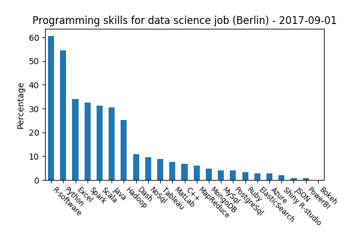
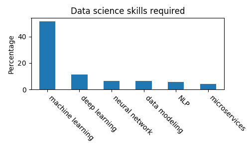

# A simple WebScraping Python code

WebScraping is a Python code to illustrate data acquisition using
`selenium` library. For this purpose, one needs often to emulate a
human being while retrieving data from the websites. In this code, we
choose the example of retrieving job data from Glassdoor and perform
some analytics on it.

Since each job description is written in a unique way, analyzing the
text to extract features, such as job requirements, are
challenging. This is a good exercise for an NLP project.

## packages used
* `warnings.warn`
* `selenium.webdriver` (for web scraping)
* `time`
* `random`
* `pandas` (for performing analytics)
* `bs4.BeautifulSoup` (for parsing the html code)
* `matplotlib`
* `json`

## How to run the code?

1. run `python -m test/test` to search for a particular job (set to be
  data scientist) in a given city (set to Berlin) and to retrieve
  information about the company, job title and the description. It
  will then save all data in `JSON` format in `data.json`.

2. run `python -m test/test0` to read the data file `data.json` and
   perform analytics on the programming skills needed for a data
   science job. The result is saved as a figure in `output`
   folder:

	
   
   As we can see `python` and `R` are by far the most popular
   scripting languages of data science. The above statistics are
   obtained by the functions defined in `src/DataCleaning.py`.
   
   Here are some more statistics:

	
   
